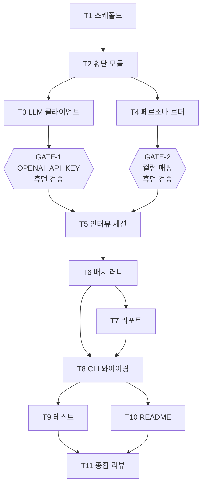

# 작업 목록: korea-persona-interview

본 문서는 PRD `docs/prd/korea-persona-interview.md`, TDD `docs/tdd/korea-persona-interview.md`(특히 §17 작업 분해, §18 의존성 그래프), UI `docs/ui/korea-persona-interview.md`, ADR-001 `docs/adr/2026-05-02-multiturn-strategy.md`를 통합한 실행 단위 작업 분해다. TDD §17의 11개 작업을 기준으로 사용자 휴먼 검증 게이트 2개와 종합 리뷰 1개를 추가하여 총 14개 작업으로 정리했다.

## 1. 도메인 분할

본 도구는 단일 도메인(Python CLI/ML 엔지니어링)이라 도메인 분할이 없다. 전 작업을 ml-engineer가 담당한다. 검토는 server-reviewer-arch, server-reviewer-quality, security-auditor 세 에이전트의 병렬 호출로 수행한다(review-all 스킬). 사용자 휴먼 검증 게이트 2개는 메인 세션이 사용자와 상호작용한다.

## 2. 작업 표

작업 ID는 TDD §17의 명명을 따른다. T1~T10은 TDD §17과 동일하며 게이트 2개와 종합 리뷰 T11을 추가했다.

| ID | 제목 | 모듈/파일 | 예상 공수 | 선행 | 담당 에이전트 | 비고 |
| --- | --- | --- | --- | --- | --- | --- |
| T1 | 프로젝트 스캐폴드 | `requirements.txt`, `requirements-dev.txt`, `config.yaml`, `.gitignore`, `src/__init__.py`, `tests/__init__.py`, `outputs/.gitkeep`, `outputs/logs/.gitkeep` | 2h | - | ml-engineer | TDD §1.6의 `dataset.field_map`, `gender_aliases`, `province_aliases` 초기값 포함. TDD §11 의존성 핀 그대로 적용한다 |
| T2 | 횡단 관심사 | `src/models.py`, `src/config.py`, `src/logging_setup.py` | 5h | T1 | ml-engineer | TDD §3.1, §3.2, §6 시그니처 그대로 적용한다. 핵심 항목은 `schema_version=1`, `Flags.truncated`, `PersonaMeta.marital`/`education`, `mask_name` 2/3/4글자 분기, `mask_product` 첫 30자와 길이, JsonLineFormatter, `bind_request_id` 컨텍스트다 |
| T3 | LLM 클라이언트 | `src/llm_client.py` | 4h | T2 | ml-engineer | TDD §3.3, §12. httpx.AsyncClient 비동기 컨텍스트 매니저, healthcheck `GET /v1/models`, chat `POST /v1/chat/completions`, 지수 백오프 재시도 1s/2s/4s에 jitter `random.uniform(0, 0.5)` 추가, 6줄 직접 구현으로 tenacity 회피, localhost 외 base_url chat 차단 가드는 security.md §1을 따른다 |
| GATE-1 | OpenAI API 키 설정 휴먼 검증 | 사용자 검증 단계 | 0.5h | T3 | 사용자와 메인 세션 | PRD §5.10 게이트 1. 사용자가 셸에서 `export OPENAI_API_KEY=sk-...`를 설정한 뒤 `python main.py healthcheck` 또는 임시 sanity 스크립트로 OpenAI `/v1/models` 200 응답과 짧은 hello dry-run 1회를 확인한다. 401(키 무효), 429(한도 초과), 5xx(OpenAI 장애)를 분기 점검한다. 통과 전까지 T5 진입을 막는다 |
| T4 | 페르소나 로더 | `src/load_personas.py` | 6h | T2 | ml-engineer | TDD §3.4, §1.6. PersonaLoader 캐시 활용 첫 로드, PersonaFilter DSL 파서와 AND/OR 결합, `_normalize_gender`/`_normalize_province` 별칭 적용/`_match_district_suffix` 시군구 부분 매칭, `sample_personas`는 `random.Random(seed).sample`로 재현성 보장, 첫 로드 시 `column_names`와 1샘플을 stdout에 출력해 게이트 2의 안전망을 둔다 |
| GATE-2 | 데이터셋 컬럼 매핑 휴먼 검증 | 사용자 검증 단계 | 0.5h | T4 | 사용자와 메인 세션 | PRD §5.10 게이트 2. T4의 PersonaLoader가 출력하는 `ds['train'].column_names`와 첫 record를 TDD §1.1, §1.2와 대조한 뒤 `config.yaml`의 `dataset.field_map`을 갱신한다. 통과 전까지 T5 진입을 막는다 |
| T5 | 멀티턴 인터뷰 세션 | `src/interview.py` | 8h | T3, T4, GATE-1, GATE-2 | ml-engineer | TDD §3.5, §7, §8, ADR-001. InterviewSession.run, `build_system_prompt`은 persona_fields 토글을 적용해 JSON 객체로 주입한다. `should_auto_follow_up`은 20자 미만 또는 모호 키워드 매칭 시 상한 1회 트리거다. `detect_persona_drift`는 영어 비율 30% 초과와 연령대/성별/지역 정면 모순 휴리스틱이다. `detect_refusal`은 거부 키워드 매칭이다. `estimate_tokens`는 한글 1, 영어 0.25, 그 외 0.5로 추정한다. `truncate_history`는 system 보존, 8000 초과 시 가장 오래된 페어 제거, `flags.truncated=True` 갱신을 수행한다. `summarize_interview`는 별도 단일턴이며 JSON 파싱 실패 1회 retry 후에도 실패하면 `None`을 반환한다 |
| T6 | 배치 러너 | `src/batch.py` | 5h | T5 | ml-engineer | TDD §3.6, §9. BatchRunner.run, `asyncio.Semaphore(concurrency)`와 `asyncio.gather(return_exceptions=True)` 조합, 동시성 4 이상 ConfigError, 시작 직전 healthcheck 자동 호출, tqdm `as_completed`와 수동 `update(1)` 패턴, 우측 카운터는 `완료=N 실패=M` 형식이다. `tqdm.write`로 단발 WARN을 보존하며 SIGINT 1회 partial 저장 후 2회 즉시 종료는 `loop.add_signal_handler`와 `asyncio.Event` 조합으로 구현한다. `save_batch_result`는 `outputs/interview_{slug}_{ts}.json`에 ensure_ascii=False로 저장한다 |
| T7 | 리포트 생성기 | `src/report.py` | 7h | T6 | ml-engineer | TDD §3.7, UI §4. 정량 집계 4종은 의향률, 가격 통계 IQR, 거절 사유 빈도, 코호트 의향률이다. `statistics` 모듈을 사용하고 코호트 셀 표본 3명 미만은 "표본 부족"으로 마스킹한다. `--include-drift` 옵션 분기, 정성 인사이트 LLM 호출 1회로 인사이트 5-10개 강제, 마크다운 4개 H2 섹션은 정량/정성/제외/한계와 출처 트리를 UI §4.6 그대로 따른다. 푸터에 CC BY 4.0과 출처, 합성 데이터 한계를 명시한다. 텍스트 막대 차트와 10구간 히스토그램을 포함한다 |
| T8 | CLI 와이어링 | `main.py` | 4h | T6, T7 | ml-engineer | TDD §15, UI §2, UI §3. click 4개 서브커맨드는 healthcheck, list-personas, interview, report다. 종료 코드 매핑은 0/1/2/3/130이다. ANSI [OK]/[WARN]/[ERR] 라벨을 텍스트로 병기해 컬러 비활성화 시에도 의미가 전달되게 한다. `--no-color`와 `NO_COLOR` 환경변수, `isatty` 검사를 모두 지원한다. 한국어 에러 메시지 사전 17종은 UI §3.1을 따른다. 정상 종료 시 `다음 단계: python main.py report ...` 안내를 출력한다. 부분 실패 즉 완료 50% 미만은 exit 3, dry-run 시 시스템 프롬프트/메타/응답/요약 4섹션을 콘솔 출력한다. 사용자 노출 예외에서 exit 코드 매핑은 TDD §5.3을 따른다 |
| T9 | 테스트 | `tests/conftest.py`, `tests/test_filter_dsl.py`, `tests/test_persona_loader.py`, `tests/test_llm_client.py`, `tests/test_interview_session.py`, `tests/test_persona_drift.py`, `tests/test_batch_runner.py`, `tests/test_report_quant.py`, `tests/test_config.py`, `tests/test_logging.py`, `tests/test_error_messages.py`, `tests/manual/smoke_e2e.py` | 8h | T8 | qa-engineer | TDD §16. pytest 8과 pytest-asyncio 0.23, pytest-httpx 0.30 조합. datasets는 monkeypatch로 5-10명 가짜 데이터셋을 만든다. 핵심 케이스는 11종이다. 필터 DSL의 AND/OR 결합과 별칭, 시군구 매칭, 시드 재현성, httpx 200/5xx/4xx/timeout과 localhost 가드, 멀티턴 누적과 system 보존, 8001 토큰 truncation, follow-up 1회 상한, 거부 키워드 분기, drift 6케이스, 동시성과 SIGINT partial, 리포트 IQR과 코호트 마스킹과 drift 자동 제외, config 우선순위, mask_name 2/3/4글자, request_id 전파를 검증한다. 한국어 에러 메시지 사전 17종은 UI §3.1 기준으로 단위 테스트를 별도 추가한다. 수동 smoke 테스트는 `tests/manual/`에 분리한다 |
| T10 | README | `README.md` | 3h | T8 | tech-writer 또는 ml-engineer | git.md §4.2. 영어로 작성한다. 구조는 Title, Description, Features, Requirements, Installation, Usage, Dataset/Model Credits, Synthetic Data Disclaimer, License 순이다. Requirements는 Python 3.12, uv, OpenAI API key를 명시한다(Apple Silicon 제약 제거, mlx-lm 의존 제거). Usage는 4개 서브커맨드 예시를 포함하며 첫 단계로 `export OPENAI_API_KEY=sk-...`를 안내한다. Credits는 엔비디아 `nvidia/Nemotron-Personas-Korea`와 CC BY 4.0을 명시한다. Disclaimer는 실제 인터뷰 대체 아님과 사업 아이템 본문이 사용자가 설정한 LLM 백엔드(OpenAI / Anthropic / 로컬 LLM / MCP 호스트 에이전트)로 송신되는 사실, 토큰 사용량을 사용자가 직접 provider 청구서와 대조해야 한다는 점을 함께 명시한다(USD 비용 추정은 v1.0.0에서 제거). License는 MIT다. 첫 데이터셋 로드 5-10분 안내를 포함한다 |
| T11 | 종합 리뷰 | review-all 스킬 | 2h | T9, T10 | server-reviewer-arch, server-reviewer-quality, security-auditor 병렬 | rules/agent-report.md §2.2 심각도 기준. 🔴 발견 시 ml-engineer가 재수정하고 재리뷰한다. 검토 포커스는 architecture.md의 계층 분리와 의존성 방향과 SOLID, api-design.md의 LLM HTTP 계약, security.md의 localhost 가드와 마스킹과 시크릿 부재, error-handling.md의 예외 비우기 금지, logging.md의 레벨과 마스킹, dependency.md의 핀과 leftpad 회피다 |

총 예상 시간은 본 작업 55시간으로 TDD §17의 52시간에 게이트 1시간과 리뷰 2시간을 더한 값이다. 약 7 영업일 규모이며 게이트 2종은 사용자 응답 대기 시간이라 실제 코딩 시간은 52시간으로 동일하다.

## 3. 의존성 그래프

병렬화 가능 구간은 아래와 같다.

- T3와 T4는 T2 완료 후 병렬 진행이 가능하다. 서로 독립이다
- T7과 T8은 T6 완료 후 병렬 진행이 가능하다. T8은 T7 모듈을 import하지만 인터페이스만 존재하면 와이어링이 가능하다
- T9와 T10은 T8 완료 후 병렬 진행이 가능하다
- T11의 server-reviewer-arch, server-reviewer-quality, security-auditor 3개 에이전트는 동시에 호출한다

## 4. 마일스톤

릴리즈 가능 기준의 중간 체크포인트를 5개 마일스톤으로 둔다.

- M1은 T1, T2, T3, GATE-1을 포함한다. 인프라 준비 완료, OpenAI API 키 응답 확인(`OPENAI_API_KEY` 설정 + `/v1/models` 200), healthcheck 명령 일부 동작이 가능하다
- M2는 T4, GATE-2를 포함한다. 데이터셋 컬럼 매핑 확정, 페르소나 로드와 필터링 동작, list-personas 명령 일부 동작이 가능하다
- M3는 T5, T6를 포함한다. 단일과 배치 인터뷰 동작, interview 명령 dry-run 통과가 가능하다
- M4는 T7, T8을 포함한다. 리포트와 CLI 완성, dry-run E2E 가능, 4개 서브커맨드 모두 동작한다
- M5는 T9, T10, T11을 포함한다. 테스트 통과, README 완료, 종합 리뷰 통과로 🔴 0건 상태다. 머지 가능하다

## 5. UI 명세 반영 항목

UI 문서에서 도출된 추가 책임은 모두 기존 작업 안에 포함된다. 추가 신규 작업은 없다. 다만 아래 책임은 작업 카드에 명시한다.

- T6과 T8에서 tqdm 카운터 형식은 `완료=N 실패=M`이고 ANSI [OK]/[WARN]/[ERR] 라벨은 텍스트로 병기해 컬러 비활성화 시에도 의미가 전달되게 한다. 단발 WARN은 `tqdm.write`로 보존한다. UI §6.1, §6.2를 따른다
- T8의 SIGINT 1회와 2회 동작은 분리한다. 1회는 partial save와 안내 메시지, 2회는 강제 종료다. UI §6.3 안내 문구를 그대로 사용한다
- T7의 리포트 마크다운은 4개 H2 섹션 트리 즉 `## 1. 정량 지표`, `## 2. 정성 인사이트`, `## 3. 제외 record 요약`, `## 4. 한계와 출처`를 UI §4.6 그대로 따른다
- T9의 한국어 에러 메시지 사전 17종은 UI §3.1을 단위 테스트 케이스로 추가한다. 동일 예외가 명령마다 다른 문구로 출력되지 않는지 검증한다. UI §3.3 일관성 점검 체크리스트를 따른다
- T8의 표 형식 출력은 한글 폭 2 가정 단순 정렬로 v1을 시작한다. 정렬 깨짐이 발생하면 v1.2.0에서 wcwidth 의존을 도입한다. UI §5.4를 참고한다

## 6. PRD 미세 차이 갱신 항목

dev-planner가 TDD 작성 중 PRD 스키마와 미세 차이를 발견했다. 후방 호환성 영향은 없으나 PRD와 정합성을 맞추기 위해 tech-writer 단계에서 아래 항목을 갱신한다.

- `persona_meta.name`은 `str | None`으로 변경한다. 데이터셋에 별도 name 컬럼이 없어 v1은 `null`을 채택한다. TDD §1.3 근거다
- `persona_meta`에 `marital`, `education` 필드를 추가한다. 데이터셋 풍부성을 활용한 결정이다. TDD §1.3 근거다
- `Flags`에 `truncated: bool` 필드를 추가한다. TDD §7과 ADR-001 §2 근거다
- 필터 DSL 별칭 매핑을 명시한다. TDD §1.6의 `gender_aliases`와 `province_aliases`를 PRD §5.5 필터 예시에 반영한다
  - 성별 별칭은 `F` ↔ `여자`, `M` ↔ `남자`, `여성` ↔ `여자`, `남성` ↔ `남자`다
  - 시도 별칭은 `서울특별시` ↔ `서울`, `광주광역시` ↔ `광주` 등 17개 시도 전부를 포함한다

위 변경은 `schema_version=1`을 유지하면서 추가만 수행하므로 후방 호환성에 영향이 없다. tech-writer 단계의 점검 항목으로 등록한다. PRD §5.4 스키마와 §5.5 필터 예시를 갱신해 정합성을 맞춘다.
