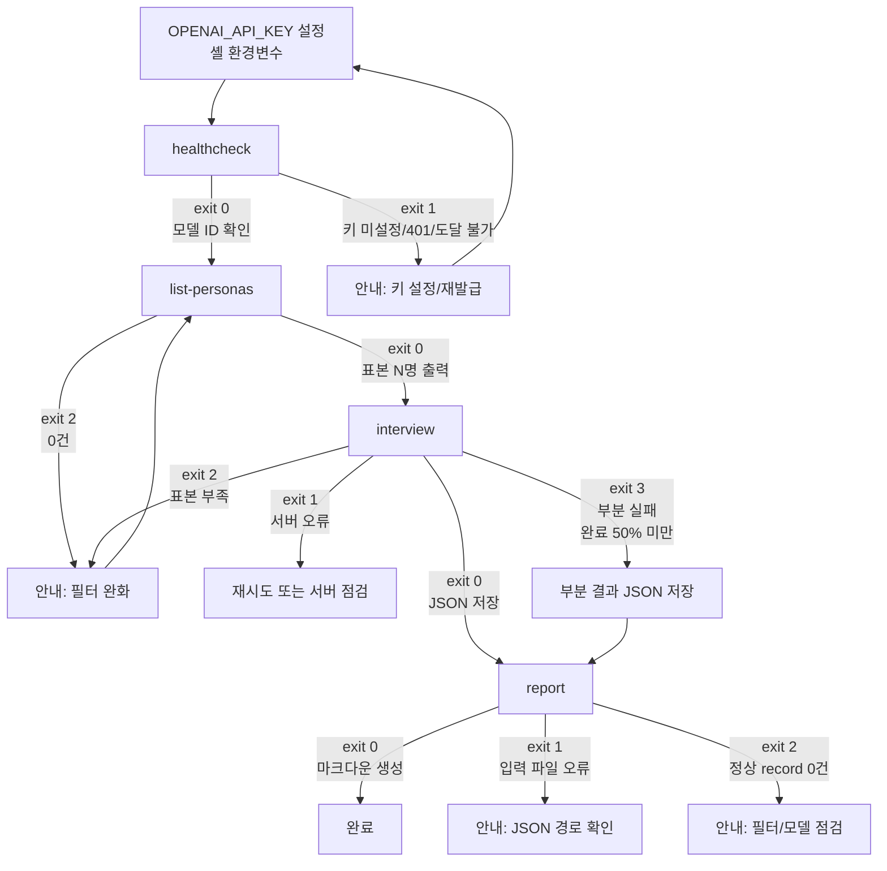

# 디자인: korea-persona-interview

본 문서는 CLI 전용 도구의 사용자 흐름과 콘솔 출력 명세, 한국어 메시지 사전, 리포트 마크다운 구성, 접근성 가이드라인을 다룬다. GUI/웹/모바일 화면은 v1 범위 밖이므로 다루지 않는다.

PRD 참조 위치는 아래와 같다.

- 전체 PRD: `/Users/binaryloader/Desktop/repository/binaryloader/korea-persona-interview/docs/prd/korea-persona-interview.md`
- CLI 서브커맨드 정의: PRD §5.9
- 실패 모드: PRD §5.8
- 리포트 정량/정성 지표: PRD §5.6, §5.7
- 관측 가능성: PRD §6.6
- 접근성과 출력: PRD §6.7

## 1. 사용자 흐름

### 1.1. 단계별 흐름

핵심 흐름은 5단계다. OpenAI API 키 설정은 본 도구가 직접 통제하지 않는 외부 의존이므로 사용자가 환경변수로 미리 설정한다.

1. 사용자가 셸에서 `export OPENAI_API_KEY=sk-...`로 OpenAI API 키를 설정한다
2. 사용자가 `python main.py healthcheck`를 실행해 OpenAI API 도달성과 모델 ID를 확인한다
3. 사용자가 `python main.py list-personas --filter "..." --limit 20`으로 표본을 미리 본다
4. 사용자가 `python main.py interview --product "..." --questions "..." --filter "..." --n 30`으로 배치 인터뷰를 실행하고 결과 JSON을 저장한다
5. 사용자가 `python main.py report outputs/interview_{slug}_{timestamp}.json`으로 리포트 마크다운을 생성한다

### 1.2. 흐름 다이어그램



### 1.3. 성공 경로

- healthcheck → list-personas → interview(전건 완료) → report(정상 record 100%) → 사용자가 마크다운 검토

### 1.4. 실패 분기

- API 키 미설정 또는 도달 불가: healthcheck 또는 interview 시작 직전 실패. exit 1과 한국어 안내로 사용자가 즉시 조치할 수 있게 한다(키 발급 URL과 export 명령 포함)
- 인증 실패(401): 키가 잘못되었거나 만료된 경우. exit 1과 한국어 안내로 키 재발급/교체를 유도한다
- 사용량 한도 초과(429): 페르소나 단위 retry 3회(1s, 2s, 4s) 후 최종 실패 시 record에 `status: failed`. 배치 시작 직전 헬스체크에서 일관되게 429를 받으면 exit 1로 즉시 중단한다
- 필터 결과 0건: list-personas 또는 interview 시작 직전 실패. exit 2와 적용된 필터 요약 표기로 다음 시도 방향을 제시한다
- 호출 타임아웃 또는 5xx: 페르소나 단위 retry 3회(1s, 2s, 4s) 후 record에 `status: failed` 기록. 다른 페르소나는 계속 진행한다
- 부분 실패: 완료된 record가 전체의 50% 미만이면 exit 3. 결과 JSON은 그대로 저장하고 사용자에게 다음 단계 안내를 출력한다
- SIGINT(Ctrl+C): 즉시 중단하지 않고 진행 중인 페르소나의 응답까지 받은 뒤 부분 결과를 JSON으로 저장한다

## 2. 명령별 콘솔 출력 명세

본 절의 출력 샘플은 가짜 데이터다. 실제 페르소나 ID, 이름, 모델 ID는 데이터셋과 사용자 환경에 따라 달라진다.

ANSI 컬러 코드는 PRD §6.7에 따라 기본 활성화되며 `--no-color` 옵션으로 비활성화한다. 본 문서의 컬러 표기는 아래 약속을 따른다.

- 정상/성공: 녹색
- 경고: 노란색
- 오류: 빨간색
- 강조 식별자(모델 ID, persona_id, 파일 경로): 청록색
- 라벨/헤더: 굵은 흰색(컬러 비활성화 시 일반 텍스트)

### 2.1. healthcheck

#### 2.1.1. 정상 출력

ANSI 컬러 적용 시 출력은 아래와 같다. `[OK]`는 녹색, 모델 ID는 청록색, 본문은 일반 텍스트다.

```text
[OK] OpenAI API 응답 정상
  Base URL: https://api.openai.com/v1
  사용 모델: gpt-4o-mini
  응답 지연: 412ms
종료 코드: 0
```

`--no-color` 적용 시 출력은 동일하지만 ANSI 이스케이프가 제거된 일반 텍스트만 남는다.

```text
[OK] OpenAI API 응답 정상
  Base URL: https://api.openai.com/v1
  사용 모델: gpt-4o-mini
  응답 지연: 412ms
종료 코드: 0
```

#### 2.1.2. 오류 출력(키 미설정)

```text
[ERR] OPENAI_API_KEY 환경변수가 설정되어 있지 않습니다.
  Base URL: https://api.openai.com/v1
  조치: https://platform.openai.com/api-keys 에서 키를 발급한 뒤 셸에서 아래 명령을 실행해 주세요.
    export OPENAI_API_KEY=sk-...
종료 코드: 1
```

#### 2.1.3. 오류 출력(401 인증 실패)

```text
[ERR] OpenAI API 키가 유효하지 않습니다.
  Base URL: https://api.openai.com/v1
  원인: HTTP 401 Unauthorized
  조치: https://platform.openai.com/api-keys 에서 키 상태를 확인하고, 만료/회수된 경우 재발급 후 다시 export 해주세요.
종료 코드: 1
```

#### 2.1.4. 오류 출력(429 사용량 한도)

```text
[ERR] OpenAI API 사용량 한도를 초과했습니다.
  Base URL: https://api.openai.com/v1
  원인: HTTP 429 Too Many Requests
  조치: 잠시 후 다시 시도하거나 https://platform.openai.com/usage 에서 한도와 결제 정보를 확인해 주세요.
종료 코드: 1
```

#### 2.1.5. 오류 출력(도달 불가)

```text
[ERR] OpenAI API에 도달할 수 없습니다.
  Base URL: https://api.openai.com/v1
  원인: 네트워크 오류 또는 OpenAI 서비스 장애
  조치: 인터넷 연결 상태와 https://status.openai.com 을 확인해 주세요.
종료 코드: 1
```

#### 2.1.6. 종료 코드 매핑

- 0: 정상(API 응답, 모델 ID 확인)
- 1: 키 미설정, 401, 429, 5xx, 연결 실패, 도달 불가

#### 2.1.7. 진행률

- 단일 호출이라 tqdm을 사용하지 않는다

### 2.2. list-personas

#### 2.2.1. 정상 출력

표 형식으로 페르소나 요약을 출력한다. 컬럼 폭은 터미널 폭에 맞춰 자동 조정한다(최소 폭 80열 가정).

```text
[INFO] 데이터셋 로드 완료(캐시: ~/.cache/huggingface)
[INFO] 적용 필터: age:25-39, region:서울특별시
[INFO] 매칭 페르소나: 384명, 표본 출력: 20명(seed=42)

  persona_id    이름        성별  연령  지역             직업
  ------------  ----------  ----  ----  ---------------  ------------------
  kp-000123     김민서      F     27    서울특별시 강남구  소프트웨어 엔지니어
  kp-000456     이재훈      M     34    서울특별시 마포구  마케팅 매니저
  kp-001890     박지연      F     31    서울특별시 송파구  데이터 분석가
  ... (총 20행)

종료 코드: 0
```

#### 2.2.2. 오류 출력(필터 결과 0건)

```text
[WARN] 필터 조건에 맞는 페르소나가 없습니다.
  적용 필터: age:65-80, region:제주특별자치도, occupation_keyword:개발자
  매칭 페르소나: 0명
  조치: 필터를 완화해 주세요. 예시는 아래와 같습니다.
    - age 범위를 넓힌다(age:50-80)
    - region을 시도 단위에서 제거한다
    - occupation_keyword를 제거하거나 다른 키워드로 바꾼다
종료 코드: 2
```

#### 2.2.3. 오류 출력(데이터셋 로드 실패)

```text
[ERR] 데이터셋을 로드하지 못했습니다.
  데이터셋: nvidia/Nemotron-Personas-Korea
  원인: HTTP 503 Service Unavailable
  조치: 인터넷 연결과 ~/.cache/huggingface 권한을 확인해 주세요.
종료 코드: 1
```

#### 2.2.4. 종료 코드 매핑

- 0: 정상(매칭 1건 이상)
- 1: 데이터셋 로드 실패
- 2: 매칭 0건

#### 2.2.5. 진행률

- 데이터셋 첫 로드 시에만 tqdm을 표시한다(`Downloading shards`, `Loading dataset`). 캐시 적중 시 표시하지 않는다

### 2.3. interview

#### 2.3.1. 정상 출력(배치 인터뷰)

```text
[INFO] 헬스체크 통과(모델: gpt-4o-mini)
[INFO] 데이터셋 로드 완료
[INFO] 적용 필터: age:25-39, region:서울특별시
[INFO] 매칭 페르소나: 384명, 표본 추출: 30명(seed=42)
[INFO] 사업 아이템: "1인 가구용 반찬 정기배송, 월 39,9..."(길이 38자)
[INFO] 사업 아이템 본문은 OpenAI 서버로 송신됩니다. 민감 정보는 입력하지 마세요.
[INFO] 질문 수: 3개, 동시성: 2, 멀티턴: 활성

인터뷰 진행 중
 60%|██████████████████████          | 18/30 [00:54<00:36, 1.8s/persona] 완료=17 실패=1

[INFO] 모든 페르소나 인터뷰 완료
  완료: 28명, 거부: 1명, 실패: 1명, 드리프트: 0명
  평균 지연: 1.9s/persona, 총 소요 시간: 1분 4초
  결과 저장: outputs/interview_korea-persona-interview_20260502_143000.json

다음 단계: python main.py report outputs/interview_korea-persona-interview_20260502_143000.json
종료 코드: 0
```

#### 2.3.2. 정상 출력(dry-run, 단일 페르소나)

```text
[INFO] 헬스체크 통과(모델: gpt-4o-mini)
[INFO] dry-run 모드: JSON 저장 없이 콘솔에만 출력합니다

--- 시스템 프롬프트 ---
당신은 다음 한국인 인물입니다.
[페르소나 정보]
{
  "name": "김민서",
  "gender": "F",
  "age": 27,
  ...
}
[지침]
- 이 인물의 연령, 직업, 거주지역에 어울리는 말투를 사용하세요.
- ...

--- 페르소나 메타 ---
persona_id: kp-000123
이름: 김민서, 성별: F, 연령: 27, 지역: 서울특별시 강남구, 직업: 소프트웨어 엔지니어

--- 질문 1: 이 서비스 쓰실 의향 있나요? ---
응답: 음, 회사 다니면서 저녁 챙겨먹기 힘들거든요. 월 4만원이면 한 번 시도해 볼 만한 것 같아요.
지연: 1.6s

--- 질문 2: 월 얼마면 적당한가요? ---
응답: 솔직히 4만원도 살짝 부담이라, 3만원대 초반이면 바로 결제할 것 같아요.
지연: 1.4s

--- 질문 3: 거절한다면 왜요? ---
응답: 반찬 종류가 단조로우면 금방 질릴 것 같아요. 알레르기 옵션도 신경 쓰이고요.
지연: 1.7s

--- 구조화 요약 ---
{
  "intent": "positive",
  "willingness_to_pay": 32000,
  "willingness_to_pay_currency": "KRW",
  "rejection_reasons": ["메뉴 단조로움", "알레르기 대응"],
  "one_line": "가격 매력 + 메뉴 다양성에 따라 결정"
}

종료 코드: 0
```

#### 2.3.3. 오류 출력(헬스체크 실패)

```text
[ERR] OpenAI API 응답에 실패했습니다. 인터뷰를 시작하지 않습니다.
  Base URL: https://api.openai.com/v1
  원인: HTTP 401 Unauthorized
  조치: OPENAI_API_KEY 환경변수를 확인하거나 https://platform.openai.com/api-keys 에서 키를 재발급해 주세요.
종료 코드: 1
```

#### 2.3.4. 오류 출력(필터 결과가 요청 N보다 적음)

```text
[WARN] 필터 결과가 요청 수보다 적습니다.
  적용 필터: age:65-80, region:제주특별자치도
  매칭 페르소나: 4명, 요청 수: 30명
  조치: --n을 줄이거나 필터를 완화해 주세요.
종료 코드: 2
```

#### 2.3.5. 오류 출력(타임아웃)

페르소나 단위 타임아웃은 record에 기록하고 다음 페르소나로 진행하는 방식이라, 콘솔에는 진행률 라인 아래에 단발 경고로만 표기한다.

```text
인터뷰 진행 중
 40%|█████████████                 | 12/30 [02:14<03:30, 11.8s/persona] 완료=10 실패=2
[WARN] persona_id=kp-002391 호출 실패(시도 3회 모두 타임아웃 120s 초과). 다음 페르소나로 진행합니다.
```

#### 2.3.6. 오류 출력(부분 실패, 완료 50% 미만)

배치가 끝난 시점에 완료된 record가 전체의 50% 미만이면 exit 3을 반환한다.

```text
[ERR] 부분 실패로 종료합니다(완료 12명 / 요청 30명, 40.0%).
  결과 저장: outputs/interview_korea-persona-interview_20260502_143000.json
  실패 사유 분포:
    - timeout: 14건
    - http_429: 3건
    - refused: 1건
  조치: OpenAI 사용량 한도와 네트워크 상태를 점검하고 재실행해 주세요.
        v1은 --resume 옵션을 제공하지 않으므로 동일 시드로 다시 실행합니다.
종료 코드: 3
```

#### 2.3.7. SIGINT(Ctrl+C) 처리

사용자가 Ctrl+C를 누르면 진행 중이던 페르소나의 현재 호출만 마무리하고 부분 결과를 저장한다.

```text
^C
[WARN] 사용자 중단 신호를 받았습니다.
  진행 중인 호출을 마무리한 뒤 부분 결과를 저장합니다.
  저장 경로: outputs/interview_korea-persona-interview_20260502_143000.json
  완료 record: 17명, 미진행: 13명
종료 코드: 130
```

#### 2.3.8. 종료 코드 매핑

- 0: 정상(요청 N명 중 50% 이상 완료)
- 1: 서버 오류, 헬스체크 실패, 데이터셋 로드 실패
- 2: 매칭 페르소나가 요청 수보다 적음(인터뷰 미시작)
- 3: 부분 실패(완료 record가 전체의 50% 미만)
- 130: 사용자 중단(SIGINT)

#### 2.3.9. 진행률

- tqdm 위치는 정상 출력 샘플의 라인이다. 형식은 아래와 같다
  - 좌측: 진행률 막대 + 백분율
  - 중앙: 완료/요청 수, 경과/잔여 시간, 페르소나 한 명당 평균 시간
  - 우측: `완료=N 실패=M`(부분 실패 카운터)
- tqdm 한 줄 라인은 `\r`로 갱신해 stdout이 깔끔하게 유지되도록 한다. 단발 WARN 메시지가 나오면 그 위에 새 라인으로 출력하고 tqdm은 아래에서 갱신을 이어간다(tqdm `write` 사용)

### 2.4. report

#### 2.4.1. 정상 출력

```text
[INFO] 입력 JSON: outputs/interview_korea-persona-interview_20260502_143000.json
[INFO] 인터뷰 메타: 30명 요청, 28명 완료, 1명 거부, 1명 실패, 0명 드리프트
[INFO] 모델: gpt-4o-mini, 시드: 42
[INFO] 정량 집계: 정상 record 28명 사용
[INFO] 정성 인사이트 생성 중(모델 호출 1회)... 완료(지연 2.8s)
[INFO] 리포트 저장: outputs/report_korea-persona-interview_20260502_143000.md

종료 코드: 0
```

#### 2.4.2. 오류 출력(입력 파일 오류)

```text
[ERR] 입력 파일을 읽지 못했습니다.
  경로: outputs/interview_typo.json
  원인: FileNotFoundError
  조치: 파일 경로를 확인해 주세요. ls outputs/로 결과 JSON을 확인할 수 있습니다.
종료 코드: 1
```

```text
[ERR] 입력 파일이 올바른 인터뷰 JSON 형식이 아닙니다.
  경로: outputs/interview_korea-persona-interview_20260502_143000.json
  원인: 필수 필드 누락(records, model)
  조치: 본 도구의 interview 명령으로 생성된 JSON인지 확인해 주세요.
종료 코드: 1
```

#### 2.4.3. 오류 출력(정상 record 0건)

```text
[ERR] 리포트를 생성할 수 있는 정상 record가 없습니다.
  전체 record: 30명
  완료: 0명, 거부: 12명, 실패: 16명, 드리프트: 2명
  조치: 모델 동작과 필터를 점검한 뒤 인터뷰를 다시 실행해 주세요.
        --include-drift 옵션을 사용하면 드리프트 record를 정량 집계에 포함할 수 있습니다.
종료 코드: 2
```

#### 2.4.4. 종료 코드 매핑

- 0: 정상
- 1: 입력 파일 오류(존재하지 않음, JSON 파싱 실패, 스키마 불일치)
- 2: 정상 record 0건

#### 2.4.5. 진행률

- 정성 인사이트 생성은 모델 호출 1회 단발이라 tqdm을 사용하지 않고 단순 경과 메시지로 표기한다(`[INFO] 정성 인사이트 생성 중...`)

## 3. 한국어 에러 메시지 사전

PRD §5.8 실패 모드와 §5.9 종료 코드를 기준으로 메시지를 통일한다. 모든 메시지는 한국어로 작성하되 식별자(모델 ID, URL, persona_id, 파일 경로)는 영문 그대로 둔다.

### 3.1. 메시지 표

| 예외/조건 | 메시지 본문 | 발생 명령 | 종료 코드 |
| --- | --- | --- | --- |
| ServerNotReachableError | OpenAI API에 도달할 수 없습니다. 인터넷 연결과 https://status.openai.com 을 확인해 주세요 | healthcheck, interview | 1 |
| ServerTimeoutError | OpenAI API 응답이 120초 안에 오지 않았습니다. 잠시 후 다시 시도해 주세요 | interview(record 단위), healthcheck | 1 또는 record `failed` |
| AuthenticationError | OpenAI API 키가 유효하지 않습니다. https://platform.openai.com/api-keys 에서 키를 확인하거나 재발급 후 export OPENAI_API_KEY=sk-... 로 설정해 주세요 | healthcheck, interview | 1 |
| RateLimitError | OpenAI API 사용량 한도를 초과했습니다. 잠시 후 다시 시도해 주세요 | healthcheck(즉시 실패), interview(record 단위 retry) | 1 또는 record `failed` |
| FilterMatchedZeroError | 필터 조건에 맞는 페르소나가 없습니다. 필터를 완화해 주세요 | list-personas, interview | 2 |
| FilterMatchedTooFewError | 필터 결과가 요청 수보다 적습니다. --n을 줄이거나 필터를 완화해 주세요 | interview | 2 |
| DatasetUnavailableError | 데이터셋을 로드하지 못했습니다. 인터넷 연결과 ~/.cache/huggingface 권한을 확인해 주세요 | list-personas, interview | 1 |
| DatasetSchemaError | 데이터셋 컬럼 구조가 config.yaml의 field_map과 다릅니다. 매핑을 갱신해 주세요 | list-personas, interview | 1 |
| ConfigError | config.yaml 설정이 올바르지 않습니다: {필드명}. 또는 OPENAI_API_KEY 환경변수가 설정되어 있지 않습니다. https://platform.openai.com/api-keys 에서 발급 후 export OPENAI_API_KEY=sk-... 로 설정해 주세요 | 모든 명령 | 1 |
| InvalidFilterError | 필터 표현식이 올바르지 않습니다: {표현식}. 형식은 `key:value,key:value`입니다 | list-personas, interview | 1 |
| ConcurrencyOutOfRangeError | 동시성은 1-3 범위만 허용합니다. 입력값: {n} | interview | 1 |
| InputFileNotFoundError | 입력 파일을 읽지 못했습니다. 경로를 확인해 주세요 | report | 1 |
| InputFileSchemaError | 입력 파일이 올바른 인터뷰 JSON 형식이 아닙니다. 본 도구의 interview 명령으로 생성된 JSON인지 확인해 주세요 | report | 1 |
| EmptyValidRecordsError | 리포트를 생성할 수 있는 정상 record가 없습니다. 모델 동작과 필터를 점검한 뒤 다시 실행해 주세요 | report | 2 |
| PartialFailureError | 부분 실패로 종료합니다(완료 {x}명 / 요청 {n}명). 부분 결과는 저장되었습니다 | interview | 3 |
| UserInterrupted | 사용자 중단 신호를 받았습니다. 부분 결과를 outputs/...json에 저장합니다 | interview | 130 |
| StructuredSummaryParseError | 구조화 요약 응답을 파싱하지 못했습니다(record 단위, structured_summary=null로 기록) | interview(record 단위) | record는 그대로 진행 |
| RefusalDetected | 모델이 응답을 거부했습니다(record 단위, status=refused) | interview(record 단위) | record는 그대로 진행 |
| PersonaDriftDetected | 페르소나 깨짐을 감지했습니다(record 단위, status=drift) | interview(record 단위) | record는 그대로 진행 |

### 3.2. 메시지 작성 원칙

- 한 메시지는 "무엇이 일어났는지" + "사용자가 무엇을 해야 하는지"를 한 문장씩 쓴다
- 명령행 예시가 필요하면 백틱 안에 그대로 적는다(`export OPENAI_API_KEY=sk-...` 형태)
- 식별자(모델 ID, persona_id, 파일 경로)는 영문 원문을 그대로 두고 한국어 안에 인용한다
- 약어를 풀어쓰는 경우만 괄호 병기를 허용한다(예: `MCP(Model Context Protocol)`). 음차된 외래어 뒤에 영어를 병기하지 않는다
- 메시지 끝에 마침표는 본문 단락이면 찍고, 표 셀과 라벨이면 찍지 않는다

### 3.3. 일관성 점검 체크리스트

- [ ] PRD §5.8 실패 모드 6종이 메시지 사전에 모두 매핑되어 있다
- [ ] 동일 예외가 명령마다 다른 문구로 출력되지 않는다
- [ ] 종료 코드와 메시지가 §5.9의 표와 어긋나지 않는다
- [ ] 메시지 본문에 사업 아이템 본문(`--product`)을 그대로 노출하지 않는다(PRD §6.6 마스킹 정책과 일관)

## 4. 결과 리포트 마크다운 섹션 구성

리포트는 `outputs/report_{slug}_{timestamp}.md` 파일로 저장한다. 본 절은 마크다운의 섹션 트리와 각 섹션의 출력 형식을 명세한다. PRD §5.6, §5.7을 기반으로 한다.

### 4.1. 헤더 섹션

문서 최상단에 H1 제목을 두고 그 아래 메타 표를 둔다.

- H1: `# 가상 인터뷰 리포트: {사업 아이템 한 줄}`
- 메타 표 항목
  - 생성 시각(ISO 8601, 사용자 로컬 타임존)
  - 입력 JSON 경로(상대 경로)
  - 모델 ID
  - 시드
  - 페르소나 수(요청 N, 완료, 거부, 실패, 드리프트)
  - 데이터셋 출처: `nvidia/Nemotron-Personas-Korea`
  - 데이터셋 라이선스: `CC BY 4.0`

예시는 아래와 같다.

```text
# 가상 인터뷰 리포트: 1인 가구용 반찬 정기배송, 월 39,900원, 주 2회 배송

| 항목 | 값 |
| --- | --- |
| 생성 시각 | 2026-05-02 14:42:18 KST |
| 입력 JSON | outputs/interview_korea-persona-interview_20260502_143000.json |
| 모델 | gpt-4o-mini(OpenAI Chat Completions API) |
| 시드 | 42 |
| 페르소나 | 요청 30명, 완료 28명, 거부 1명, 실패 1명, 드리프트 0명 |
| 데이터셋 | nvidia/Nemotron-Personas-Korea(CC BY 4.0) |
```

### 4.2. 정량 지표 섹션

H2: `## 1. 정량 지표`. 하위에 H3 4개를 둔다.

#### 4.2.1. 의향률

- H3: `### 1.1. 의향률`
- 표: 카테고리(positive/neutral/negative), 인원, 비율
- 텍스트 막대 차트(블록 문자 ▇를 백분율 폭으로 사용)
- 정상 record 28명 기준 표기 명시

예시는 아래와 같다.

```text
### 1.1. 의향률

집계 대상: 정상 record 28명(전체 30명 중 거부 1명, 실패 1명 제외)

| 의향 | 인원 | 비율 |
| --- | --- | --- |
| positive | 17 | 60.7% |
| neutral | 7 | 25.0% |
| negative | 4 | 14.3% |

```
positive  ▇▇▇▇▇▇▇▇▇▇▇▇▇▇▇▇▇▇▇▇▇▇▇▇▇▇▇▇▇▇  60.7%
neutral   ▇▇▇▇▇▇▇▇▇▇▇▇                    25.0%
negative  ▇▇▇▇▇▇▇                         14.3%
```
```

#### 4.2.2. 가격 수용가

- H3: `### 1.2. 가격 수용가`
- 표: 중앙값, 25퍼센타일(IQR 하단), 75퍼센타일(IQR 상단), 최소, 최대, null 비율
- 10개 구간 히스토그램(텍스트 막대)
- 통화는 KRW 고정(structured_summary.willingness_to_pay_currency)

예시는 아래와 같다.

```text
### 1.2. 가격 수용가(KRW)

| 지표 | 값 |
| --- | --- |
| 중앙값 | 32,000 |
| 25퍼센타일 | 25,000 |
| 75퍼센타일 | 39,900 |
| 최소 | 15,000 |
| 최대 | 59,000 |
| null 비율 | 14.3%(4/28) |

```
15,000 - 19,400  ▇▇          2명
19,400 - 23,800  ▇▇▇▇        4명
23,800 - 28,200  ▇▇▇▇▇▇▇     7명
...
```
```

#### 4.2.3. 거절 사유 빈도

- H3: `### 1.3. 거절 사유 빈도`
- `rejection_reasons` 배열을 펼쳐서 빈도 상위 N개(기본 N=10)를 표로 출력
- 빈도 동률 시 사전 순으로 정렬

예시는 아래와 같다.

```text
### 1.3. 거절 사유 빈도(상위 10개)

| 순위 | 사유 | 빈도 |
| --- | --- | --- |
| 1 | 가격 부담 | 12 |
| 2 | 메뉴 단조로움 | 9 |
| 3 | 알레르기 대응 | 6 |
| 4 | 배송 시간대 | 5 |
| 5 | 1인 가구 양 조절 | 4 |
| ... | ... | ... |
```

#### 4.2.4. 코호트별 의향률

- H3: `### 1.4. 코호트별 의향률`
- 3축: 연령대(20대/30대/40대/50대/60대 이상), 지역(시도), 성별(F/M)
- 셀별 표본이 3명 미만이면 "표본 부족"으로 마스킹
- 섹션 상단에 "셀별 표본 수가 작아 차이는 참고용"이라는 주의 문구 출력

예시는 아래와 같다.

```text
### 1.4. 코호트별 의향률

셀별 표본 수가 작아 차이는 참고용입니다. 표본 3명 미만 셀은 "표본 부족"으로 마스킹합니다.

#### 1.4.1. 연령대별

| 연령대 | 표본 | positive | neutral | negative |
| --- | --- | --- | --- | --- |
| 20대 | 8 | 75.0% | 12.5% | 12.5% |
| 30대 | 14 | 57.1% | 28.6% | 14.3% |
| 40대 | 6 | 50.0% | 33.3% | 16.7% |
| 50대 이상 | 0 | 표본 부족 | 표본 부족 | 표본 부족 |

#### 1.4.2. 지역별

(생략)

#### 1.4.3. 성별

(생략)
```

### 4.3. 정성 인사이트 섹션

H2: `## 2. 정성 인사이트`. 하위에 H3 3개를 둔다.

#### 4.3.1. 공통 반응

- H3: `### 2.1. 공통 반응`
- 5개 이내 항목으로 불렛 출력
- 각 항목 끝에 해당 반응을 보인 페르소나 수 또는 비율 병기

#### 4.3.2. 인사이트

- H3: `### 2.2. 인사이트`
- 5-10개 항목으로 강제(범위 밖이면 모델 재생성 또는 잘라내기)
- 각 항목은 한 문장 시사점 + 한 문장 근거(정량 지표 인용)

예시는 아래와 같다.

```text
### 2.2. 인사이트

1. 30대 1인 가구가 핵심 타깃이다. 30대 의향률 57%, 가격 수용가 중앙값 32,000원으로 현재 가격대와 정합한다
2. 가격 39,900원은 상한선에 가깝다. 75퍼센타일이 39,900원이라 인하 여지를 검토할 만하다
3. 메뉴 단조로움이 이탈 요인이다. 거절 사유 2위로 빈도 9건이며 30대/40대 모두에서 공통적으로 언급되었다
... (5-10개 범위)
```

#### 4.3.3. 코호트 차이

- H3: `### 2.3. 페르소나 군별 차이`
- 자유 서술이지만 셀별 표본 3명 이상에 한해 언급
- 연령대/지역/성별 각각 한 단락 이상

### 4.4. 제외 record 요약 섹션

H2: `## 3. 제외 record 요약`. 정량 통계에서 제외된 record를 별도 섹션으로 분리한다.

```text
## 3. 제외 record 요약

| 사유 | 인원 | 비율 |
| --- | --- | --- |
| refused(모델 응답 거부) | 1 | 3.3% |
| failed(모든 retry 실패) | 1 | 3.3% |
| drift(페르소나 깨짐) | 0 | 0.0% |

정량 집계는 위 record를 제외한 28명을 기준으로 합니다. `--include-drift` 옵션을 적용하면 drift record도 정량 집계에 포함됩니다.
```

### 4.5. 푸터 섹션

H2: `## 4. 한계와 출처`. 합성 페르소나의 한계와 데이터셋 라이선스를 명시한다.

```text
## 4. 한계와 출처

본 리포트는 합성 페르소나 데이터(`nvidia/Nemotron-Personas-Korea`)와 OpenAI Chat Completions API 추론 결과를 결합하여 생성되었습니다. 합성 페르소나의 분포는 실제 인구 통계 분포와 일치하지 않을 수 있고, 응답은 모델의 추론 결과이므로 실제 한국인 응답자의 의견을 대체하지 않습니다. 본 도구는 실제 인터뷰 직전 단계의 가설 검증과 질문지 점검 용도로 사용하시기 바랍니다. 사업 아이템 본문과 페르소나 정보는 OpenAI 서버로 송신되었으며 OpenAI 약관에 따라 처리됩니다.

- 데이터셋 출처: nvidia/Nemotron-Personas-Korea(https://huggingface.co/datasets/nvidia/Nemotron-Personas-Korea)
- 데이터셋 라이선스: CC BY 4.0
- 추론 모델: gpt-4o-mini(OpenAI Chat Completions API)
```

### 4.6. 섹션 트리 요약

```text
# 가상 인터뷰 리포트: {사업 아이템 한 줄}
| 메타 표 |
## 1. 정량 지표
### 1.1. 의향률
### 1.2. 가격 수용가
### 1.3. 거절 사유 빈도
### 1.4. 코호트별 의향률
#### 1.4.1. 연령대별
#### 1.4.2. 지역별
#### 1.4.3. 성별
## 2. 정성 인사이트
### 2.1. 공통 반응
### 2.2. 인사이트
### 2.3. 페르소나 군별 차이
## 3. 제외 record 요약
## 4. 한계와 출처
```

## 5. 접근성(CLI 한정)

GUI가 없는 도구이므로 WCAG의 시각적 항목은 비적용 대상이다. CLI 환경에서 적용 가능한 접근성 항목으로 한정한다.

### 5.1. ANSI 컬러와 --no-color

- 컬러는 의미 보강 수단으로만 사용한다. 컬러 없이도 메시지가 전달되어야 한다(예: `[OK]`, `[WARN]`, `[ERR]` 라벨을 텍스트로 함께 출력)
- `--no-color` 옵션과 `NO_COLOR` 환경 변수를 모두 지원한다(no-color.org 표준). 둘 중 하나라도 설정되어 있으면 ANSI 이스케이프를 출력하지 않는다
- 파이프(`|`) 또는 리다이렉션(`>`)으로 stdout이 TTY가 아닐 때는 자동으로 컬러를 끈다(`isatty` 검사)

### 5.2. 한국어 메시지 일관성

- 모든 사용자 안내, 경고, 오류 메시지는 한국어를 기본으로 한다
- 식별자(모델 ID, persona_id, 파일 경로, URL, HTTP 코드)는 영문 그대로 둔다
- 약어 풀이만 괄호 병기를 허용한다(`API(Application Programming Interface)`)
- 음차된 외래어 뒤에 영어 원문을 병기하지 않는다(예: "프리미엄(freemium)" 금지)

### 5.3. 한국어 + 영문 식별자 혼용 가독성

- 한국어 본문 안에 영문 식별자가 들어갈 때는 식별자 앞뒤에 공백을 둔다
  - O: "모델 gpt-4o-mini 로 호출했습니다"
  - X: "모델gpt-4o-mini로호출했습니다"
- 식별자가 길면 인라인 코드(백틱)로 감싸서 식별자 영역을 시각적으로 분리한다
  - O: 모델 `gpt-4o-mini`로 호출했습니다
- persona_id는 본문에서 `kp-NNNNNN` 형식 그대로 사용하고 한국어 명사("페르소나")를 앞에 붙인다(예: "페르소나 kp-000123이 응답을 거부했습니다")

### 5.4. 표 형식 출력의 가독성

- 표는 모든 셀의 폭을 헤더 + 본문의 최댓값에 맞춰 정렬한다(좌측 정렬 기본)
- 한국어 글자(2 셀 폭)와 영문 글자(1 셀 폭) 혼용을 고려해 `wcwidth` 기반 폭 계산을 사용한다
- 터미널 폭이 80열 미만이면 일부 컬럼을 생략한다(직업 컬럼 우선 생략)
- 가급적 박스 그리기 문자(└ ─ ┘ 등)를 피하고 공백과 하이픈만 사용해 폰트 의존성을 줄인다

### 5.5. 스크린 리더와 스크롤백

- 진행률 tqdm은 `\r`로 한 줄 갱신을 사용해 스크롤백 오염을 막는다
- 단발 INFO/WARN/ERR 메시지는 새 라인으로 출력해 스크롤백에 보존한다
- 리포트는 마크다운 파일로 저장되므로 스크린 리더가 텍스트로 직접 읽을 수 있다(GUI 의존 없음)

## 6. 진행률과 부분 실패 처리 UX

PRD §6.2 신뢰성, §6.6 관측 가능성, §5.8 실패 모드를 기반으로 한다.

### 6.1. tqdm 표시 형식

interview 배치 인터뷰에서만 tqdm을 사용한다. list-personas와 report는 단발 작업이라 사용하지 않는다.

```text
인터뷰 진행 중
 60%|██████████████████████          | 18/30 [03:24<02:16, 11.4s/persona] 완료=17 실패=1
```

- 좌측 라벨: `인터뷰 진행 중`
- 진행률 막대: 30칸(터미널 폭 80 기준), 백분율 정수
- 카운터: `현재완료/총요청`(중복 카운팅 없이 record 응답 수신 시점에 1 증가)
- 시간: 경과 / 잔여(tqdm 자동 계산), 페르소나 1명당 평균 시간
- 우측 카운터: `완료=N 실패=M`(부분 실패 가시화)

### 6.2. 단발 메시지와 tqdm의 공존

- record 단위 WARN(타임아웃, retry 진행, drift 감지)은 `tqdm.write()`로 출력해 진행률 라인을 깨뜨리지 않는다
- record 단위 INFO는 기본 출력하지 않고 JSONL 로그(`outputs/logs/run_{timestamp}.jsonl`)에만 기록한다

### 6.3. SIGINT(Ctrl+C) 처리

- 사용자가 Ctrl+C를 한 번 누르면 진행 중인 호출의 응답을 기다린 뒤 부분 결과를 저장한다
- 두 번 누르면 즉시 종료한다(asyncio task cancel + 저장 시도). 두 번째 신호를 받기 전 1초 안내 메시지를 출력한다

```text
^C
[WARN] 사용자 중단 신호를 받았습니다.
  진행 중인 호출을 마무리한 뒤 부분 결과를 저장합니다.
  한 번 더 Ctrl+C를 누르면 즉시 종료합니다.
  저장 경로: outputs/interview_korea-persona-interview_20260502_143000.json
  완료 record: 17명, 미진행: 13명
종료 코드: 130
```

### 6.4. 부분 실패 종료 후 사용자 안내

PRD §5.9에 정의된 exit 3(완료 record 50% 미만)은 결과 JSON 저장 후 다음 단계 안내를 출력한다.

```text
[ERR] 부분 실패로 종료합니다(완료 12명 / 요청 30명, 40.0%).
  결과 저장: outputs/interview_korea-persona-interview_20260502_143000.json
  실패 사유 분포:
    - timeout: 14건
    - http_5xx: 3건
    - refused: 1건
다음 단계 안내:
  1. MLX 서버 메모리와 동시성을 점검합니다(--concurrency 2 권장).
  2. 동일 시드(--seed 42)로 다시 실행하면 같은 페르소나 표본이 추출됩니다.
  3. 부분 결과 JSON으로 리포트를 만들 수 있습니다(정상 record가 1건 이상이면).
     python main.py report outputs/interview_korea-persona-interview_20260502_143000.json
주의: --resume 옵션은 v1에서 제공하지 않습니다. v2 후보로 검토 중입니다.
종료 코드: 3
```

### 6.5. 정상 종료 후 다음 단계 안내

```text
다음 단계: python main.py report outputs/interview_korea-persona-interview_20260502_143000.json
```

interview 정상 종료 시 마지막 라인에 위 안내를 출력한다. 사용자가 그대로 복사해 다음 명령으로 진행할 수 있게 한다.

### 6.6. JSONL 로그 동시 기록

- 콘솔과 별도로 `outputs/logs/run_{timestamp}.jsonl`에 구조화 로그를 기록한다
- 로그 한 줄은 JSON 객체이며 필드는 `ts`, `level`, `event`, `persona_id`, `latency_ms`, `retry`, `error`이다
- 사업 아이템 본문(`--product`)은 첫 30자 + 길이로 마스킹한다(PRD §6.6)

### 6.7. UX 점검 체크리스트

- [ ] tqdm 진행률은 record 응답 수신 시점에 1씩 증가한다(병렬 호출 race 없음)
- [ ] 단발 WARN은 tqdm 위에 새 라인으로 보존된다
- [ ] SIGINT 한 번으로 부분 결과가 저장된다
- [ ] 부분 실패 종료 시 사용자가 다음 명령을 그대로 복사할 수 있다
- [ ] `--no-color` 적용 시 진행률 막대도 단색으로 출력된다
- [ ] 표 출력은 한국어 + 영문 혼용에서 컬럼이 어긋나지 않는다(wcwidth 기반)
